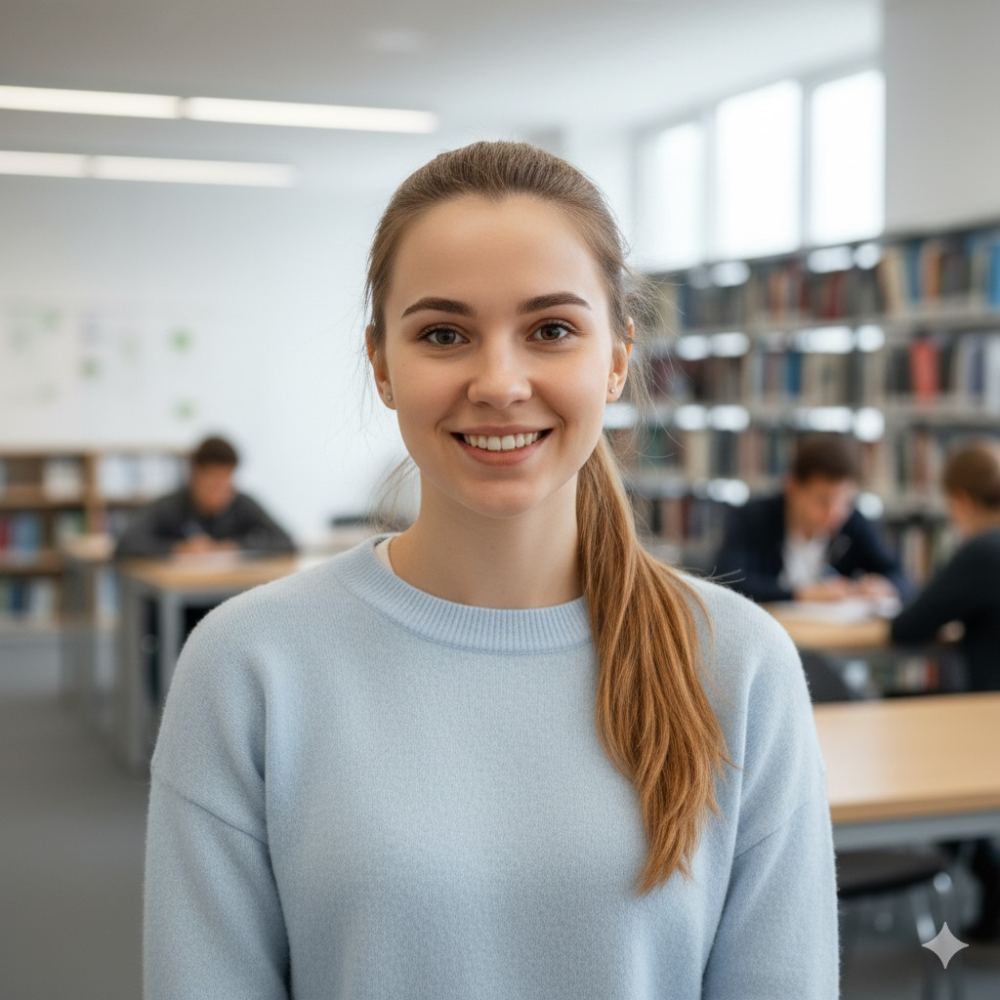
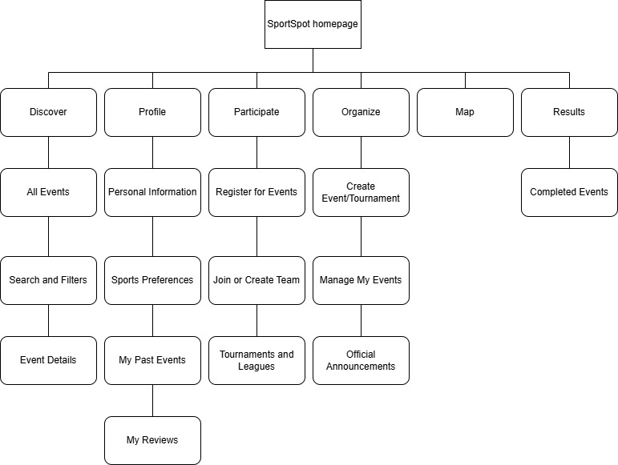

# SportSpot - 2nd assignment

## User Personas
| Damir Petrović                                | Sara Vuković                              | Luka Perak                                |
|------------------------------------------|-----------------------------------------|------------------------------------------|
|         |       |          |
| *Age:* 28                             | *Age:* 22                            | *Age:* 44                             |
| *Occupation:* Software Engineer    | *Occupation:* University Student     | *Occupation:* History Teacher  
| Organized, competitive, social, time-conscious  | Energetic, curious, open-minded, community-oriented  | Supportive, patient, detail-oriented, socially engaged
| *Bio:* Works in IT and spends most of his day at a computer; enjoys weekend football but struggles to find matches and players.        | *Bio:* Active student who loves sports and socializing; wants to find sports events that fit her schedule. | *Bio:* Passionate about local sports and his son’s basketball games; wants to stay informed about local events.        |
| *Goals:* Find local matches and teams, join tournaments, track schedules and results. | *Goals:* Discover sports events near university, meet new people, join student tournaments. | *Goals:* Follow local results, support teams, share info with students and parents. |

### Sitemap
