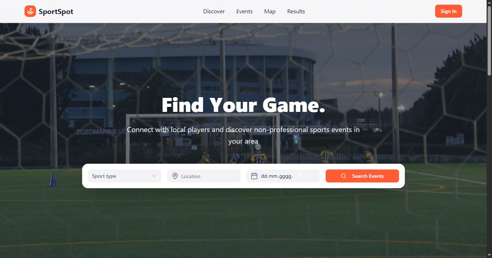
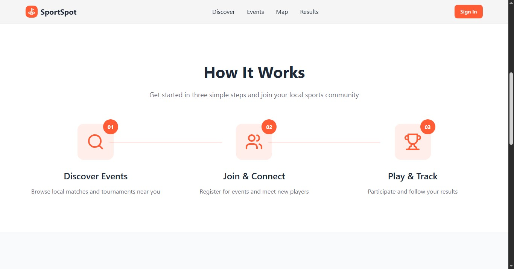
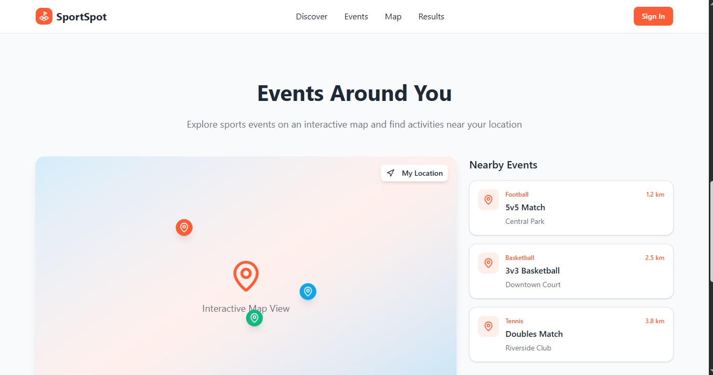
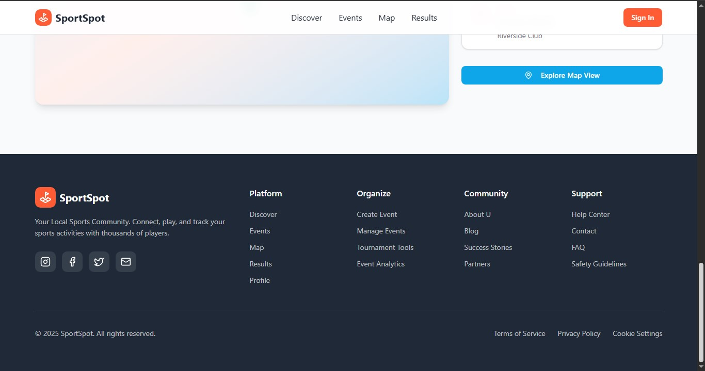

# SportSpot – High-Fidelity Prototype

We developed a high-fidelity prototype to demonstrate the main features and user flow of the SportSpot platform. The prototype includes key sections such as event search, an interactive map with nearby activities, and a simple step-by-step flow showing how users discover, join, and track events. Our focus was on creating a clean, intuitive interface that supports community building and easy access to non-professional sports activities.

## Prototype Screens

### Home / Hero Section

### How It Works

### Events Around You

### Footer & Navigation

